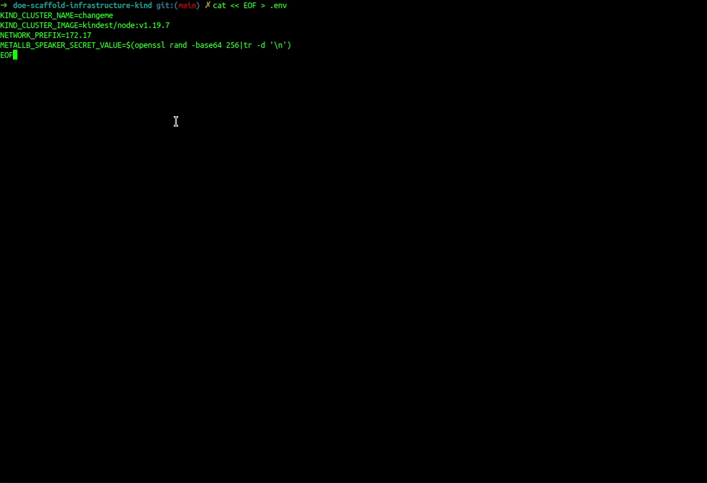
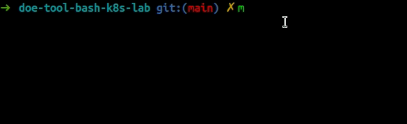

# Kubernetes Development Lab

This repo brings together different tools around Application development hosted in a Kubernetes cluster.

`You Build It, You Run It`

With theses tools, you can :
- develop quickly Kubernetes infrasctructure
- develop without depending on external resources
- develop as close as possible to the final execution platform
- easily reproduce contexts
- implement & test scaling
- implement & test high availability
- realize chaos engineering

<p align="center">
A Kubernetes story
</p>
<p align="center">
<a href="https://www.youtube.com/watch?v=R9-SOzep73w">

</a>
<a href="https://www.youtube.com/watch?v=R9-SOzep73w">

</a>
<a href="https://www.youtube.com/watch?v=3I9PkvZ80BQ">

</a>
<a href="https://www.youtube.com/watch?v=3I9PkvZ80BQ">

</a>
</p>


# Toolbox

Use the following command in order to install all-in-one tools
```bash
make install
```

| name                              	| type    	| information                                	| install                     	|
|-----------------------------------	|---------	|--------------------------------------------	|-----------------------------	|
| [Docker Engine](#docker-engine)   	| package 	| open source containerization technology    	| `make install-docker`        	|
| [kind](#kind)                     	| binary  	| Kubernetes IN Docker                       	| `make install-kind`          	|
| [helm](#helm)                     	| binary  	| The package manager for Kubernetes         	| `make install-helm`          	|
| [lens](#lens)                     	| snap    	| The Kubernetes IDE                         	| `make install-lens`          	|
| [kubectl](#kubectl)               	| package 	| The Kubernetes command-line tools          	| `make install-kubectl`      	|
| [kubectx](#kubectx)               	| binary  	| manage and switch between kubectl contexts 	| `make install-kubectx`       	|
| [kubens](#kubens)                 	| binary  	| switch between Kubernetes namespaces       	| `make install-kubens`        	|
| [jq](#jq])                         	| package 	| a command-line JSON processor             	| `make install-packages`      	|
| [yq](#yq)                          	| snap    	| a command-line YAML processor              	| `make install-yq`            	|
| [dnsmasq](#dns)                   	| package 	| Domain Name System                         	| `make install-dnsmasq`       	|
| [dig](#dig)                       	| package 	| querying the Domain Name System           	| `make install-packages`      	|
| [ping](#ping)                   	  | package 	| test the reachability of a host             | `make install-packages`     	|
| [nc](#nc)                   	      | package 	| R/W to network connections using TCP or UDP	| `make install-packages`      	|
| [certutil](#certutil)               | package 	| Linux Cert Management tools	                | `make install-packages`      	|


## [Docker Engine](https://docs.docker.com/get-started/overview/)

<p align="center"><a href="https://docs.docker.com/get-started/overview/"></a></p>


Docker is an open platform for developing, shipping, and running applications. Docker enables you to separate your applications from your infrastructure so you can deliver software quickly. With Docker, you can manage your infrastructure in the same ways you manage your applications. By taking advantage of Docker’s methodologies for shipping, testing, and deploying code quickly, you can significantly reduce the delay between writing code and running it in production.


<p align="center"><a href="https://docs.docker.com/get-started/overview/#docker-architecture"></a></p>

## [kind](https://kind.sigs.k8s.io/)
<p align="center"><a href="https://kind.sigs.k8s.io/"></a></p>


`kind` or **k**ubernetes **in** **d**ocker  is a tool for running local Kubernetes clusters using Docker container “nodes”.
kind was primarily designed for testing Kubernetes itself, but may be used for local development or CI.


kind consists of:
- Go [packages](https://github.com/kubernetes-sigs/kind/tree/main/pkg) implementing [cluster creation](https://github.com/kubernetes-sigs/kind/tree/main/pkg/cluster), [image build](https://github.com/kubernetes-sigs/kind/tree/main/pkg/build), etc.
- A command line interface ([`kind`](https://github.com/kubernetes-sigs/kind/blob/main/main.go)) built on these packages.
- Docker [image(s)](https://github.com/kubernetes-sigs/kind/tree/main/images) written to run systemd, Kubernetes, etc.
- [`kubetest`](https://github.com/kubernetes/test-infra/tree/master/kubetest) integration also built on these packages (WIP)


<p align="center"><a href="https://kind.sigs.k8s.io/docs/design/initial#overview"></a></p>

## [Helm](https://helm.sh/)

<p align="center"><a href="https://helm.sh/">

</a></p>


Helm is a tool for managing Charts. Charts are packages of pre-configured Kubernetes resources.

Use Helm to:
- Find and use popular software packaged as Helm Charts to run in Kubernetes
- Share your own applications as Helm Charts
- Create reproducible builds of your Kubernetes applications
- Intelligently manage your Kubernetes manifest files
- Manage releases of Helm packages

## [Lens](https://github.com/lensapp/lens)

Lens IDE provides the full situational awareness for everything that runs in Kubernetes. It's lowering the barrier of entry for people just getting started and radically improving productivity for people with more experience.

[](https://www.youtube.com/watch?v=eeDwdVXattc)


## [kubectl](https://github.com/kubernetes/kubectl)

<p align="center"><a href="https://github.com/kubernetes/kubectl">
</a></p>


The Kubernetes command-line tool, kubectl, allows you to run commands against Kubernetes clusters. You can use kubectl to deploy applications, inspect and manage cluster resources, and view logs.

## [kubectx](https://github.com/ahmetb/kubectx)
kubectx is a utility to manage and switch between kubectl contexts.

<p align="center"><a href="https://github.com/ahmetb/kubectx"></a></p>

## [kubens](https://github.com/ahmetb/kubectx)
kubens is a utility to switch between Kubernetes namespaces.

<p align="center"><a href="https://github.com/ahmetb/kubectx"></a></p>

## [jq](https://github.com/stedolan/jq)
jq is a lightweight and flexible command-line JSON processor.

If you want to learn to use jq, read the documentation at https://stedolan.github.io/jq. This documentation is generated from the docs/ folder of this repository. You can also try it online at jqplay.org.

```json
curl -s https://www.gstatic.com/ipranges/cloud.json | jq '[[.prefixes[] | del(.service) | select(.scope | match("^europe-west1$") ) ] | limit(3; .[] )]'
[
  {
    "ipv4Prefix": "8.34.208.0/23",
    "scope": "europe-west1"
  },
  {
    "ipv4Prefix": "8.34.211.0/24",
    "scope": "europe-west1"
  },
  {
    "ipv4Prefix": "8.34.220.0/22",
    "scope": "europe-west1"
  }
]

```

## [yq](https://github.com/mikefarah/yq)

yq is a lightweight and portable command-line YAML processor. yq uses jq like syntax but works with yaml files as well as json. It doesn't yet support everything jq does - but it does support the most common operations and functions, and more is being added continuously.

```yaml
curl -s https://www.gstatic.com/ipranges/cloud.json | jq '[[.prefixes[] | del(.service) | select(.scope | match("^europe-west1$") ) ] | limit(3; .[] )]'|yq eval -P
- ipv4Prefix: 8.34.208.0/23
  scope: europe-west1
- ipv4Prefix: 8.34.211.0/24
  scope: europe-west1
- ipv4Prefix: 8.34.220.0/22
  scope: europe-west1
```

## dig

dig is a network administration command-line tool for querying the Domain Name System (DNS).

dig is useful for network troubleshooting and for educational purposes. It can operate based on command line option and flag arguments, or in batch mode by reading requests from an operating system file. When a specific name server is not specified in the command invocation, it uses the operating system's default resolver, usually configured in the file resolv.conf. Without any arguments it queries the DNS root zone. 

Example
```bash
dig A +short server.domain.tld
172.17.255.1
```

## ping

Ping is a computer network administration software utility used to test the reachability of a host on an Internet Protocol (IP) network. It is available for virtually all operating systems that have networking capability, including most embedded network administration software

Example
```bash
ping server.domain.tld       
PING server.domain.tld (172.17.255.1) 56(84) bytes of data.
64 octets de server.domain.tld : icmp_seq=1 ttl=116 temps=44.5 ms
64 octets de server.domain.tld : icmp_seq=2 ttl=116 temps=44.2 ms
64 octets de server.domain.tld : icmp_seq=3 ttl=116 temps=44.6 ms
64 octets de server.domain.tld : icmp_seq=4 ttl=116 temps=44.1 ms
^C
--- statistiques ping server.domain.tld ---
4 paquets transmis, 4 reçus, 0 % paquets perdus, temps 3005 ms
rtt min/avg/max/mdev = 44.068/44.341/44.637/0.224 ms
```

## nc

**netcat** (often abbreviated to **nc**) is a computer networking utility for reading from and writing to network connections using **TCP** or **UDP**. The command is designed to be a dependable back-end that can be used directly or easily driven by other programs and scripts. At the same time, it is a feature-rich network debugging and investigation tool, since it can produce almost any kind of connection its user could need and has a number of built-in capabilities.

Its list of features includes port scanning, transferring files, and port listening, and it can be used as a backdoor. 

Example
```bash
nc -vz 172.17.255.1 80                                                                      
Connection to 172.17.255.1 80 port [tcp/domain] succeeded!
```

## certutil

On Linux, browsers uses the NSS Shared DB, you can configure certificates with the NSS command line tools.

### List all certificates
```bash
certutil -d sql:$HOME/.pki/nssdb -L
```
### List details of a certificate
```bash
certutil -d sql:$HOME/.pki/nssdb -L -n <certificate nickname>
```
### Add a certificate
```bash
certutil -d sql:$HOME/.pki/nssdb -A -t <TRUSTARGS> -n <certificate nickname> -i <certificate filename>
```
The `TRUSTARGS` are three strings of zero or more alphabetic characters, separated by commas. They define how the certificate should be trusted for SSL, email, and object signing, and are explained in the [certutil docs](https://developer.mozilla.org/en-US/docs/Mozilla/Projects/NSS/tools/NSS_Tools_certutil) or [Meena's blog post](https://blogs.oracle.com/meena/about-trust-flags-of-certificates-in-nss-database-that-can-be-modified-by-certutil) on trust flags.
### Delete a certificate
```bash
certutil -d sql:$HOME/.pki/nssdb -D -n <certificate nickname>
```

# Prerequisite

## Environment variables

Create `.env` file with following vars:
| var                          	| definition                               	| more                                       	                       | example                  	 |
|------------------------------	|------------------------------------------	|------------------------------------------------------------------- |---------------------------- |
| KIND_CLUSTER_NAME            	| cluster name                             	|                                            	                       | changeme                 	 |
| KIND_CLUSTER_IMAGE           	| kubernetes version                       	| https://hub.docker.com/r/kindest/node/tags 	                       | kindest/node:v1.19.7     	 |
| KUBE_CONTEXT            	    | kubernetes context                        |                                            	                       | kind-${KIND_CLUSTER_NAME}   |
| NETWORK_PREFIX               	| network prefix                           	| CIDR: 172.17.0.0/16                        	                       | 172.17                   	 |
| METALLB_SPEAKER_SECRET_VALUE 	| random 256 character alphanumeric string 	| $(openssl rand -base64 256\|tr -d '\n')                            | bpP0AGV07oQt9jjNINJQFQ== 	 |
| ARGOCD_SERVER_ADMIN_PASSWORD 	| random 14 character alphanumeric string 	| \$(< /dev/urandom tr -dc _A-Z-a-z-0-9 \| head -c${1:-20};echo;)    | UA31wt3D5gCDX-idW-BK        |
| GRAFANA_ADMIN_PASSWORD 	      | random 14 character alphanumeric string 	| \$(< /dev/urandom tr -dc _A-Z-a-z-0-9 \| head -c${1:-20};echo;)    | LvxiXjaNTnF3oZiiKA9Y        |
| GITLAB_TOKEN 	                | random 14 character alphanumeric string 	| \$(< /dev/urandom tr -dc _A-Z-a-z-0-9 \| head -c${1:-20};echo;)    | iew6DX_otY1pDfzgmFq-        |

Example:
```bash
KIND_CLUSTER_NAME=changeme
cat << EOF > .env
KIND_CLUSTER_NAME=$KIND_CLUSTER_NAME
KIND_CLUSTER_IMAGE=kindest/node:v1.19.7
KUBE_CONTEXT=kind-${KIND_CLUSTER_NAME}
NETWORK_PREFIX=172.17
METALLB_SPEAKER_SECRET_VALUE=$(openssl rand -base64 256|tr -d '\n')
ARGOCD_SERVER_ADMIN_PASSWORD=$(< /dev/urandom tr -dc _A-Z-a-z-0-9 | head -c${1:-20};echo;)
GRAFANA_ADMIN_PASSWORD=$(< /dev/urandom tr -dc _A-Z-a-z-0-9 | head -c${1:-20};echo;)
GITLAB_TOKEN=$(< /dev/urandom tr -dc _A-Z-a-z-0-9 | head -c${1:-20};echo;)
EOF
```

## [Configuration](https://kind.sigs.k8s.io/docs/user/configuration/)

Create kind-config.yaml in order to customize kind cluster, folling example will create 1 control-plane and 1 worker. We affect a label to this worker.

Example:
```bash
cat << EOF > kind-config.yaml
---
kind: Cluster
apiVersion: kind.x-k8s.io/v1alpha4
nodes:
- role: control-plane
- role: worker
  kubeadmConfigPatches:
  - |
    kind: JoinConfiguration # InitConfiguration
    nodeRegistration:
      kubeletExtraArgs:
        node-labels: "role=api"
EOF
```

> reference: [https://kind.sigs.k8s.io/docs/user/configuration/](https://kind.sigs.k8s.io/docs/user/configuration/)

## Volumes

You can share a local volume with kind cluster and mount it into your POD thanks [PV](https://kubernetes.io/docs/concepts/storage/persistent-volumes/) and PVC

```yaml
---
kind: Cluster
apiVersion: kind.x-k8s.io/v1alpha4
nodes:
- role: control-plane
  # add a mount from /path/to/my/files on the host to /files on the node
  extraMounts:
  - hostPath: /path/to/my/files/
    containerPath: /files
```

> reference: [https://stackoverflow.com/questions/62694361/how-to-reference-a-local-volume-in-kind-kubernetes-in-docker](https://stackoverflow.com/questions/62694361/how-to-reference-a-local-volume-in-kind-kubernetes-in-docker)


# [kind](https://kind.sigs.k8s.io/)

## Create kubernetes cluster & deploy charts

Use the following command in order to initialize all-in-one steps

```bash
make create
```

| name                              	          | type    	| information                                	| install                     	|
|-----------------------------------	          |---------	|--------------------------------------------	|------------------------------	|
| docker-network                     	          | chart   	| create a docker network                     | `make create-docker-network` 	|
| kind                               	          | chart   	| create a kind cluster                     	| `make create-kind`           	|
| [Metrics Server](#metrics-server) 	          | chart   	| deploy Metrics Server into cluster        	| `make deploy-metrics-server` 	          |
| [MetalLB](#metallb)               	          | chart   	| deploy MetalLB into cluster                	| `make deploy-metallb`        	          |
| [Nginx Ingress Controller](#nginx-ingress-controller) 	| chart   	| deploy Metrics Server into cluster        	| `make deploy-nginx-ingress-controller` 	|
| [Cert Manager](#cert-manager) 	| chart   	| deploy Cert Manager into cluster        	| `make deploy-cert-manager` 	|
| [Cert Manager](#kube-prometheus-stack) 	| chart   	| deploy Cert Manager into cluster        	| `make deploy-kube-prometheus-stack` 	|




## Destroy
```bash
make destroy
```


## [Metrics Server](https://github.com/kubernetes-sigs/metrics-server)

Metrics Server is a scalable, efficient source of container resource metrics for Kubernetes built-in autoscaling pipelines.

Metrics Server collects resource metrics from Kubelets and exposes them in Kubernetes apiserver through Metrics API for use by [Horizontal Pod Autoscaler](https://kubernetes.io/docs/tasks/run-application/horizontal-pod-autoscale/) and Vertical Pod Autoscaler. Metrics API can also be accessed by kubectl top, making it easier to debug autoscaling pipelines.

```bash
$ kubectl top pods --all-namespaces
NAMESPACE     NAME                                                              CPU(cores)   MEMORY(bytes)   
kube-system   alb-ingress-controller-aws-alb-ingress-controller-67d7cf85lwdg2   3m           10Mi            
kube-system   aws-node-9nmnw                                                    2m           20Mi            
kube-system   coredns-7bcbfc4774-q4pjj                                          2m           7Mi             
kube-system   coredns-7bcbfc4774-wwlcr                                          2m           7Mi             
kube-system   external-dns-54df666786-2ld9w                                     1m           12Mi            
kube-system   kube-proxy-ss87v                                                  2m           10Mi            
kube-system   kubernetes-dashboard-5478c45897-fcm48                             1m           12Mi            
kube-system   metrics-server-5f64dbfb9d-fnk5r                                   1m           12Mi            
kube-system   tiller-deploy-85744d9bfb-64pcr                                    1m           29Mi
```

Metrics Server is not meant for non-autoscaling purposes. For example, don't use it to forward metrics to monitoring solutions, or as a source of monitoring solution metrics.

Metrics Server offers:

- A single deployment that works on most clusters (see Requirements)
- Fast autoscaling, collecting metrics every 15 seconds.
- Resource efficiency, using 1 mili core of CPU and 2 MB of memory for each node in a cluster.
- Scalable support up to 5,000 node clusters.

Metrics Server is deploy with Helm Chart: https://hub.kubeapps.com/charts/bitnami/metrics-server/5.8.9

Example of an YAML config file:
```yaml
---
apiService:
  create: true
extraArgs:
  kubelet-insecure-tls: true
  kubelet-preferred-address-types: InternalIP
```

## [MetalLB](https://metallb.universe.tf/)

MetalLB is a load-balancer implementation for bare metal Kubernetes clusters, using standard routing protocols.
It handles the ServiceType: Loadbalancer.

We can use MetalLB in order to reserve an IP Address in docker network and expose our kubernetes services.

MetalLB is deploy with Helm Chart: https://hub.kubeapps.com/charts/bitnami/metallb/2.5.4

Example of an YAML config file:
```yaml
---
configInline:
  # The address-pools section lists the IP addresses that MetalLB is
  # allowed to allocate, along with settings for how to advertise
  # those addresses over BGP once assigned. You can have as many
  # address pools as you want.
  address-pools:
  - # A name for the address pool. Services can request allocation
    # from a specific address pool using this name, by listing this
    # name under the 'metallb.universe.tf/address-pool' annotation.
    name: generic-cluster-pool
    # Protocol can be used to select how the announcement is done.
    # Supported values are bgp and layer2.
    protocol: layer2
    # A list of IP address ranges over which MetalLB has
    # authority. You can list multiple ranges in a single pool, they
    # will all share the same settings. Each range can be either a
    # CIDR prefix, or an explicit start-end range of IPs.
    addresses:
    - 172.17.255.1-172.17.255.254
speaker:
  ## random 256 character alphanumeric string
  ## openssl rand -base64 256
  secretValue: |
    wruDKc9D8TDiopJ8HlYph2/JTMeBTsJV80p5N5uD1QJSEHH7gagm6K/OtEZuvmll
    9ggkaZp/55CF/rvxVGhoqH1lVASv28zBGx4OskWN7wMqOPdEed48RFLi41+3N2RA
    WBoc4prQV8LWLLq8+xWC7Mh2iDzlXFhDTjVMAqtEAFVX7uZ+1MbPMkBm2Qt/QJSl
    rzZjVQ1KBc3Vxc6STCp6iQjVrrm2dBz8/FrrziEfLRmF8JzQHethE2c8Wn/1JNvj
    Ma1g8Bj1nCH8nGddOAlQ8lu7yLpuVMYXtDYWXzknRc4A7IAMcdREZL5FQMYpu19g
    1Xa2rGCUkJ/S2lVwc4EzaQ==
```

## [Nginx Ingress Controller](https://kubernetes.github.io/ingress-nginx/)

Ingress-nginx is an Ingress controller for Kubernetes using NGINX as a reverse proxy and load balancer.

Ingress-nginx is deploy with Helm Chart: https://hub.kubeapps.com/charts/bitnami/nginx-ingress-controller/7.6.21

Example of an YAML config file:
```yaml
---
apiService:
  create: true
extraArgs:
  kubelet-insecure-tls: true
  kubelet-preferred-address-types: InternalIP
service:
  loadBalancerIP: 172.17.255.200
```

## [Cert Manager](https://cert-manager.io/docs/)

cert-manager is a native Kubernetes certificate management controller. It can help with issuing certificates from a variety of sources, such as Let’s Encrypt, HashiCorp Vault, Venafi, a simple signing key pair, or self signed.

cert-manager is deploy with Helm Chart: https://hub.kubeapps.com/charts/bitnami/cert-manager/0.1.20

Example of an YAML config file:
```yaml
---
installCRDs: true
```

## [kube-prometheus-stack](https://github.com/prometheus-community/helm-charts/tree/main/charts/kube-prometheus-stack)

Installs the kube-prometheus stack, a collection of Kubernetes manifests, Grafana dashboards, and Prometheus rules combined with documentation and scripts to provide easy to operate end-to-end Kubernetes cluster monitoring with Prometheus using the Prometheus Operator.

kube-prometheus-stack is deploy with Helm Chart: https://hub.kubeapps.com/charts/prometheus-community/kube-prometheus-stack/18.0.3

Example of an YAML config file:
```yaml
---
grafana:
  adminPassword: changeme
alertmanager:
  ingress:
    enabled: true
    annotations:
      kubernetes.io/ingress.class: nginx
    pathType: Prefix
    hosts:
      - alertmanager.changeme.lan
    tls:
    - secretName: monitoring-tls-certificate
      hosts:
      - alertmanager.changeme.lan
grafana:
  ingress:
    enabled: true
    annotations:
      kubernetes.io/ingress.class: nginx
    hosts:
      - grafana.changeme.lan
    tls:
    - secretName: monitoring-tls-certificate
      hosts:
      - grafana.changeme.lan
prometheus:
  ingress:
    enabled: true
    annotations:
      kubernetes.io/ingress.class: nginx
    pathType: Prefix
    hosts:
      - prometheus.changeme.lan
    tls:
    - secretName: monitoring-tls-certificate
      hosts:
      - prometheus.changeme.lan
```

# DNS

## create your DNS config

By default, a explicit start-end range of IPs is reserved for MetalLB : `${NETWORK_PREFIX}.255.1-${NETWORK_PREFIX}.255.254`

`Choose an IP Address in MetalLB IP address ranges and affect it to a fqdn`

Example
```bash
cat << EOF > dnsmasq-example.conf
address=/server.domain.tld/172.17.255.1
EOF
```
`each file with following pattern: dnsmasq*.conf will be copied into dnsmasq config folder`

## apply DNS config

```bash
make config-dnsmasq
```

## What's happened ?

1. remove immutable attribute on /etc/resolv.conf
2. delete /etc/resolv.conf
3. add 127.0.0.1 into /etc/resolv.conf
4. add DNS server gived by DHCP server into /etc/resolv.conf
5. add 8.8.8.8 (google DNS server) into /etc/resolv.conf
6. add immutable attribute on /etc/resolv.conf
7. declare port 53 and host 127.0.0.1 in dnsmasq config file
8. copy dnsmasq*.conf files into dnsmasq config folder
9. disable service systemd-resolved
10. restart service dnsmasq

`YOU NEED TO APPLY DNS CONFIG EACH TIME YOU CHANGE NETWORK CONTEXT, EXAMPLE: VPN CONNECTION ETC`

